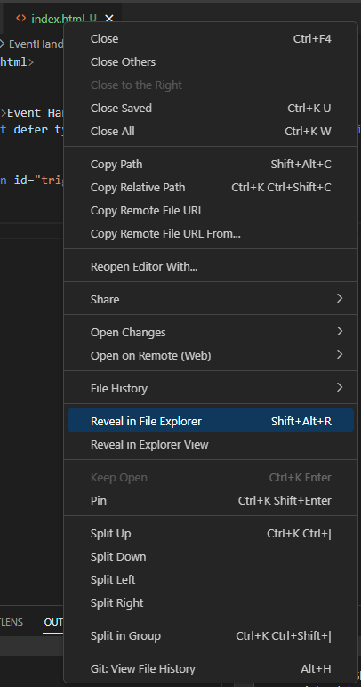

[<- Tilbake](/README.md#arbeidskrav)

# Interrupts

## Callbacks og Event Handlers

For å forstå interrupt koden kan det hjelpe å først få en bedre forståelse for callbacks. Selv om c++ også har mulighet for dette, egner JavaScript seg bedre som en introduksjon. Åpne [index.html](EventHandlers/index.html) og se på html koden. På linje 8 defineres en knapp med id="trigger". Denne brukes for å hente knappen i [script.js](EventHandlers/script.js), hvor denne øvingen har fokus.

- Åpne [index.html](EventHandlers/index.html) i filsystemet som vist under, og dobbelklikk den for å åpne den i en nettleser.

  - For å åpne en vscode fil i filsystemet, høyreklikk fanen øverst på skjermen og velg "Reveal in file explorer".

    

- Når har åpnet filen i nettleseren, åpne devtools konsollen og se på verdiene som printes.
    - Windows: `Ctrl + Shift + J`
    - Mac: `Option + ⌘ + J`

- Prøv å trykk på knappen og se hva som skjer.

- Eksperimenter med å endre koden i [script.js](EventHandlers/script.js) for å få en bedre forståelse for callback og event handler konseptet. Husk å lagre kodefilen og trykke refresh i nettleseren for at endringene dine skal tre i kraft.

## Oppgaver

- [Hvorfor](why/why.ino)
- [Flagg](flags/flags.ino)
- [Debounce](debounce/debounce.ino)
