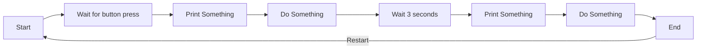
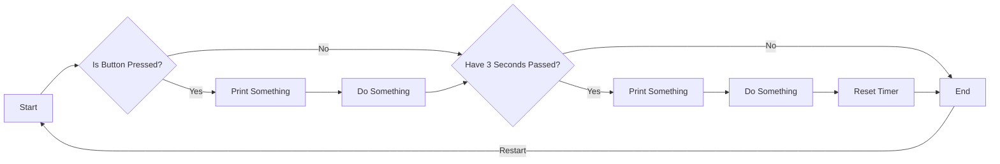

[<- Tilbake](/README.md#arbeidskrav)

# NonBlockingCode

Synkron kode betyr at alle instruksjoner kjører en etter en i en spesifikk rekkefølge. Diagrammet under vil for eksempel ha en kjøretid på minst 3 sekunder.



[Asynkron](https://www.techtarget.com/searchnetworking/definition/asynchronous) kode skiller seg fra synkron kode ved at instruksjoner kan skje i en uvilkårlig rekkefølge uten å hverandre. Grafen under kan for eksempel ha en kjøretid på noen mikrosekunder.



Nedenfor skal dere lage asynkrone alternativer til noen synkrone programmeringsprinsipper.

## Asynkron `delay()`

Fiks koden slik at LED-tilstanden endres umiddelbart når knapp-tilstanden endres. Du skal ikke endre koden i loop() eller updateLed(). Dette er et krav fordi vi ønsker å simulere en situasjon hvor koden vi ønsker å endre er en del av en større kodebase som vi ikke kan endre.

- [Kode](delay/delay.ino)

## Asynkron `while()`

Produser kode som har tilsvarende funksjonalitet, men bruk if-setninger istedenfor while-løkker.

- [Kode](IfAsWhile/IfAsWhile.ino)

## Asynkron `for()`

### Rekonstruksjon med `while()`

For å konstruere en ikke-blokkerende for-løkke, er det nyttig å først reformulere den som en while-løkke med ekstra steg.

Produser kode som har samme oppførsel, men bruker en while-løkke istedenfor en for-løkke. Denne koden **SKAL** fortsatt være blokkerende.

- [Kode](ForAsWhile/ForAsWhile.ino)

### Ferdigstilling

Nå har du sannsynligvis end opp med en lokal variabel, og en while-løkke. Hvis dette ikke er tilfellet, kontakt en veileder.

Nå skal du gjøre følgende:

1. Gjør om while-løkken til en ikke-blokkerende while-løkke, som i den tidligere oppgaven.
   - Hva skjer med den lokale variabelen?

```
Refleksjon:
...
```

2. Gjør om den lokale variabelen til en global variabel.
   - Hva skjer med den globale variabelen?

```
Refleksjon:
...
```

For-løkken skal nå ha samme funksjonalitet som før, men kun den første gangen den kjører. Du har sannsynligvis en if-setning som kjører for-løkke koden. Hvis det ikke er tilfellet, kontakt en veileder.

Legg til en `else` etter if-setningen. Denne kjøres når for-løkken ikke lenger skal kjøre. Bruk denne til å nullstille den globale variabelen.

```
Refleksjon:
...
```

## Tilstandsmaskiner

### Kjør disse demoene og reflekter over hvordan de fungerer

- [Ingen](NoStateMachine/NoStateMachine.ino)
- [If](IfStateMachine/IfStateMachine.ino)
- [Switch](SwitchStateMachine/SwitchStateMachine.ino)
- [Inkrementerende](IncrementStateMachine/IncrementStateMachine.ino)

```
Refleksjon:
Denne typen tilstandsmaskin gjør det mulig å ...
```

### Sammenlign disse demoene

Reflekter over likheter og forskjeller. Hvorfor produserer de ikke samme resultat i seriemonitoren?

- [Betinget](LingeringStateMachine/LingeringStateMachine.ino)
- [Betinget Uten Tilstandsmaskin](BlockingLingeringStateMachine/BlockingLingeringStateMachine.ino)

```
Refleksjon:
Disse to sketchene er nermest funksjonelt like, med unntak av ...
```

### Løs problemstillingene

- [Tidsbasert](TimedStateMachine/TimedStateMachine.ino)
- [Tidsbasert Uten Tilstandsmaskin](BlockingTimedStateMachine/BlockingTimedStateMachine.ino)

```
Refleksjon:
Ved å bruke tilstandsmaskiner for å kjøre oppgaver som
må vente en gitt tid før de fortsetter, kan vi også ...
```

### Løs problemstillingene

- [Tidsbasert](TimedStateMachine/TimedStateMachine.ino)
- [Tidsbasert Uten Tilstandsmaskin](BlockingTimedStateMachine/BlockingTimedStateMachine.ino)

```
Refleksjon:
Ved å bruke tilstandsmaskiner for å kjøre oppgaver som
må vente en gitt tid før de fortsetter, kan vi også ...
```

## For-løkke i tilstandsmaskin

Bruk det du ha lært for å oversette [denne](ForWithoutStateMachine/ForWithoutStateMachine.ino) blokkerende sekvensielle koden til en ikke-blokkerende sekvensiell kode med en tilstandsmaskin. Bruk [denne](ForWithStateMachine/ForWithStateMachine.ino) koden som utgangspunkt.

Fokuser først på å oversette for-løkken, og la `delay()` være i koden.
Hva er loop time da?

```
Refleksjon:
Loop time med delay() er ca:
```

Erstatt `delay()` med sin asynkrone versjon. Hva er loop time da?

```
Refleksjon:
Loop time uten delay() er ca:
```

Reflekter rundt forskjellen i loop time, og hvordan blokkerende/ikke-blokkerende kode kan påvirke andre deler av koden i større prosjekter med flere tusen linjer kode, mange separate komponenter, eller flere som jobber i et team. Hva er mer komplisert? Å designe litt mer kompliserte enkeltkomponenter som er uavhengige av/påvirker hverandre, eller å designe enkle komponenter som er avhengige av/påvirker hverandre?

```
Refleksjon:
Tilstandsmaskiner gjør det mer praktisk å implementere for-løkker
som må kjøres i en bestemt rekkefølge, fordi ...
```
