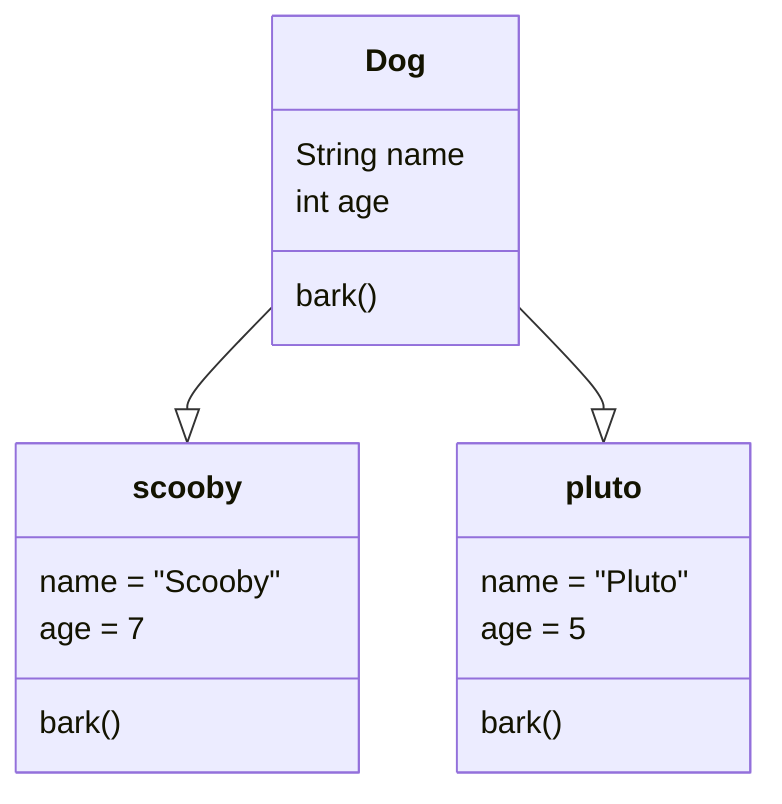

[<- Tilbake](/README.md#arbeidskrav)

# Structs

## Hva er structs?

Structs er nyttige for å samle relatert kode, gjenbruk av kode og for å gjøre koden mer lesbar.

I diagrammet under definerer "Dog" en datatype som inneholder feltene/variablene name og age, samt metoden/funksjonen bark(). scooby og pluto er variabler med datatypen Dog, som begge har egne verdier for variablene name og age. Variablene scooby og pluto kalles instanser av typen Dog. Begge variablene har også tilgang til metoden bark(). Hvis bark() benytter seg av variablene name og age, vil verdiene som tilhører "pluto" bli brukt når `pluto.bark()` kalles, og verdiene som tilhører "scooby" vil bli brukt når `scooby.bark()` kalles.



## Demoer

### Starteksempel

Kjør [kodesnutten](dog/dog.ino) og ekspermineter med forskjellige verdier og variabler for å forstå hvordan den virker.

### Standardverdier

Man kan spesifisere standardverdier for variabler i et struct. Kjør [kodesnutten](DefaultValues/DefaultValues.ino) og eksperimenter med koden til du forstår hvordan konseptet virker.

### Getters og Setters

Ett av formålene med structs er å abstrahere/forenkle bruk av komplisert kode slik at den er lettere å lese. Et eksempel på en abstraksjon er gasspedalen i en bil. I stede for å tenke på hvordan drivstoffet havner i motoren, trenger du ikke vite annet enn at når du trykker på gasspedalen så går bilen fremover. Av denne grunn er det god praksis å ikke bruke struct variabler direkte. I stede er det vanlig å lage "getters" og "setters" for å hente eller sette verdien til variabler som trengs utenfor structet.

Kjør [kodesnutten](GettersAndSetters/GettersAndSetters.ino) og eksperimenter med koden til du forstår hvordan konseptet virker.

### LED eksempel

Her er et eksempel på hvordan et struct kan utvikles og hvilke fordeler det kan gi. Senere skal dere utvikle en liknende komponent for en knapp.

#### Fremgangsmåte

- Lag funksjonalitet for komponenten i en egen sketch, slik at den kan testes for seg selv.
  - Sørg for at all kode får funksjoner med beskrivende navn.
  - [Resultat](BeforeStructDemo/BeforeStructDemo.ino)
- Kopier funksjonene og de tilhørende globale variablene inn i en struct.
  - [Resultat](AfterStructDemo/AfterStructDemo.ino)
- Siden variablene og funksjonene nå kun brukes i sammenheng med et struct, renger ikke lenger navnet på komponenten å inkluderes i navnet på variablene og funksjonene.
  - [Resultat](AfterStructDemoPrettyNames/AfterStructDemoPrettyNames.ino)
- Nå som funksjonene og variablene er gruppert i et struct, er det lett å lage flere instanser for flere komponenter av samme type.
  - [Resultat](AfterStructDemoPrettyNamesMultiple/AfterStructDemoPrettyNamesMultiple.ino)

#### Refleksjon

- Hvilke fordeler gir bruken av structs i LED eksemplet?
- Hva måtte du ha gjort hvis du skulle brukt funksjonene fra det første eksemplet for flere LEDs uten å bruke structs?
- Hvor lett er det å bruke et struct på nytt i et annet prosjekt sammenlignet med mange funksjoner og globale variabler?

```
Refleksjon:
...
```

## Når bør structs brukes?

Structs har ekstremt mange bruksområder, og derfor har et helt fagfelt utviklet seg rundt konseptet. Slike kraftige verktøy kommer alltid med mange fallgruver og potensielt økt kompleksitet hvis de brukes feil. Dette kurset kommer kun til å introdusere de enkleste konseptene, og av den grunn er det lurt å holde seg til punktene under frem til man har blitt mer komfortabel med bruken av structs.

- Bruk ett struct per fysiske komponent
  - Knapp
  - Led
  - Motor
  - Oled Skjerm
- Et struct bør ha et svært spesifikt formål
  - Eksempler på struct med navn Led
    - Bra
      - Holde på tilstanden/lysstyrken til en LED
      - Ha funksjoner for å aktivere og deaktivere en LED
    - Ikke bra
      - Vente på et knappetrykk og skru på en LED
        - Dette krever tilgang til knappen, som ikke har noe med en Led å gjøre, og bør derfor være i en global funksjon eller i et annet struct som for eksempel heter LedController
  - Eksempler på struct med navn Button
    - Bra
      - Lese av de fysiske verdiene
      - Beregne og presentere tilstandene til en knapp på en brukervennlig måte
    - Ikke bra
      - Kjøre kode når knappen trykkes
        - Informasjon om knappetrykket bør lagres i en tilstand som er tilgjengelig for globale funksjoner og andre structs
- Hvis et struct inneholder en funksjon som trenger tilgang til et annet struct, er det bedre å fjerne funksjonen fra structet og gjøre den global.

  - Hvis dette ikke er praktisk kan funksjonen ta inn det andre structet som et argument (husk [pass-by-reference](/Exercises/PassByReference/README.md))

    ```cpp
    struct Led {
        int pint = 13;

        void on() {
            digitalWrite(pin, HIGH);
        }
    };

    struct LedController {
        void update(Led &led) {
            led.on();
            delay(1000);
            led.off();
            delay(1000);
        }
    };

    Led led1;
    Led led2;
    LedController ledController;

    void loop() {
        ledController.update(led1);
        ledController.update(led2);
    }
    ```

- Du kan også lage globale funksjoner som tar structs som argumenter (husk [pass-by-reference](/Exercises/PassByReference/README.md))

    ```cpp
    void updateLedControls(Button &button, Led &led) {
        if (button.risingEdge) {
            led.on();
        }

        if (button.fallingEdge) {
            led.off();
        }
    }

    Led led1;
    Led led2;
    Button button1;
    Button button2;

    void loop() {
        updateLedControls(button1, led1);
        updateLedControls(button2, led2);
    }
    ```

## Oppgaver

### Gjør om kode til structs

Bruk det du har lært om structs til å skrive om [koden](RewriteWithStructs/RewriteWithStructs.ino). Under er noen viktige spørsmål å stille til koden før den deles opp.

- Hvilke funksjoner er relatert til samme komponent eller problemstilling?
- Hvilke globale variabler brukes i hvilke funksjoner?
- Er det noen funksjoner som utfører samme oppgave men med andre globale variabler?
- Inneholder noen av funksjonene funksjonalitet som ikke hører hjemme med kun en av komponentene?

### Valgfri oppgave: Legg til nye komponenter

Legg til en ekstra knapp og en ekstra LED i koden fra forrige oppgave. Den nye LEDen skal reagere på den nye knappen på samme måte som den første LEDen reagerer på den første knappen. Implementer løsningen din i [denne](TwoButtonsAndTwoLeds/TwoButtonsAndTwoLeds.ino) filen.

### Valgfri oppgave: Utvid kretsen

Legg til valgfrie komponenter i kretsen og lag structs for dem. Implementer løsningen din i [denne](ExtendedCircuit/ExtendedCircuit.ino) filen.