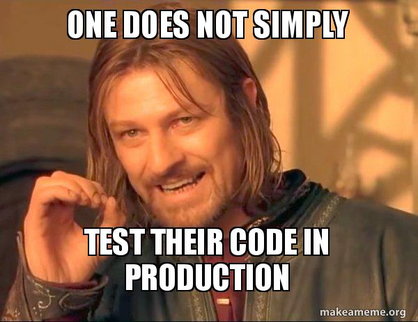

[<- Tilbake](/README.md#arbeidskrav)

# Test Dreven Utvikling

Test-dreven utvikling (TDD) er et viktig konsept, som gjør mer komplekse oppgaver enklere å kvalitetssikre, samtidig som de gjør større programmer på flere tusen linjer tryggere å endre, siden man kan stole på at testene plukker opp viktige endringer i oppførsel. I dette tilfellet har TDD blitt brukt for å sikre at dekoderen produserer riktige verdier. Det finnes flere [testrammeverk](https://maker.pro/arduino/tutorial/using-unit-test-frameworks-with-arduino) i alle programmeringsspråk, men i dette tilfellet demonstreres det hvordan et slikt rammeverk kan bygges opp manuelt.



Det er svert viktig for sikkerhet at testkode aldri havner i produksjonsmiljøer. Vanligvis vil rammeverk inkludere et separat system slik at tester kan kjøres i egne filer, men i dette tilfelle har preprosessor direktiver blitt brukt i stede. Når `#define RUN_TESTS` er kommentert ut og koden rekompileres, kan man se at deler av koden er skygget ut. Sjekk [koden](/.arduino/output/preproc/ctags_target_for_gcc_minus_e.cpp) generert av preprosessoren for å se resultatet.

## Eksempel

Kjør [demoen](Tests.ino) og reflekter over noen brukstilfeller.

```
Refleksjon:
Test Dreven Utvikling er en fordel når ...
```
