[<-- Tilbake](/README.md)

# Oppsett av utviklingsmiljø

Oppsettet i denne filen trenger du kun gjøre en gang.

NB!

Kjør alle stegene i rekkefølge til punkt og prikke. Om du ønsker å gjøre personalisering av utviklingsmiljøet, så kan du gjøre det etter at du har fått alt til å fungere.

## Lag en GitHub bruker

Lag en [GitHub bruker](https://github.com/signup). Bruk personlig e-post slik at du ikke mister tilgang til kontoen din når du er ferdig med studiene.

Du kan trykke "Skip personalization" nederst på siden når du har opprettet en bruker og du får spørsmål.

## Installer VSCode

Last ned [VSCode](https://code.visualstudio.com/download)
Kjør installasjonen med disse innstillingene

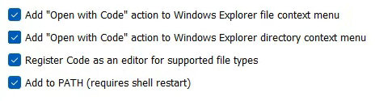

## Installer Git

Gå gjennom installasjonsguiden
[[Windows](git/windows/README.md)]

Åpne vscode
Åpne en terminal. Legg merke til hurtigtasten. Den er nyttig!

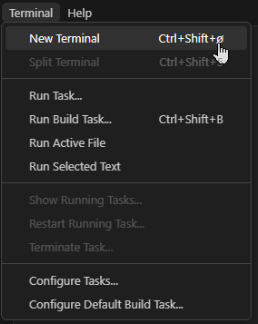

Kjør disse to kommandoene i terminalen som dukket opp nederst på skjermen.

```
git config --global user.name "ditt github brukernavn"
```

```
git config --global user.email "din github epost"
```

## Lag fork av repository

Lag en fork av dette [Github Repo](https://github.com/IELS1001-23-24/programming-course)

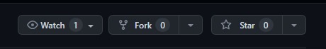

## Logg inn med GitHub bruker i VSCode

Naviger til Source Control og trykk Clone Repository

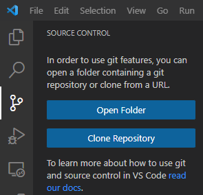

Velg Clone from GitHub

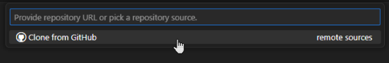

Du blir nå videreført til nettleseren. Autoriser VSCode til å logge inn på GitHub brukeren din.

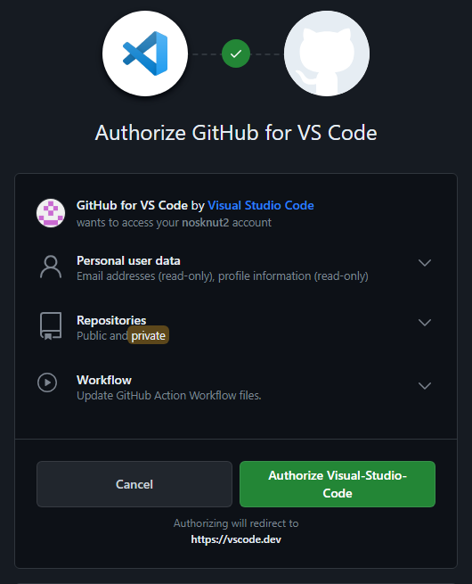

Trykk Åpne Visual Studio Code

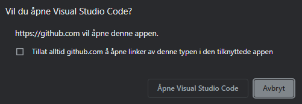

Trykk Open

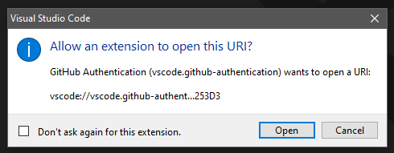

Du er nå innlogget med GitHub brukeren din på VSCode

## Clone repository

Velg ditt nye repository som du forket tidligere

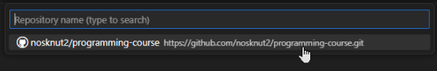

Når cloningen er ferdig, trykk open

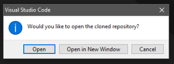

## Installer recommended extensions

Vi har laget en egen liste med extensions dere kommer til å trenge i løp av året. Trykk Install

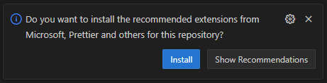

Scroll gjennom WORKSPACE RECOMMENDED og trykk Install på alle.

Gå videre til neste trinn når alle er installerte (den blå knappen install/installing) forsvinner.

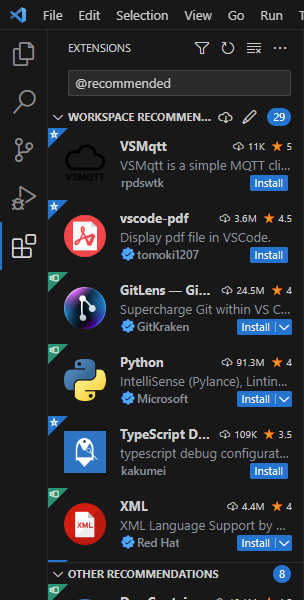

## Arduino extension feilmelding

Hvis du får dette spørsmålet, trykk Use bundled arduino-cli

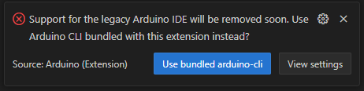

## Konfigurer Wokwi extension

Åpne command palette

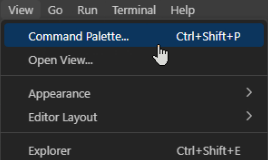

Kjør kommandoen

```
Wokwi: Manually Enter License Key
```

Lim inn lisensnøkkelen og trykk enter

<!--
This markdown is commented out because it is unused

Lag en [Wokwi](https://wokwi.com/) bruker
Abonner på [Wokwi Club](https://wokwi.com/club)

Kjør kommandoen

`Wokwi: Request a New License`

Trykk Get Your License


Trykk Åpne Visual Studio Code

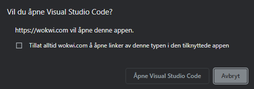

Trykk Open

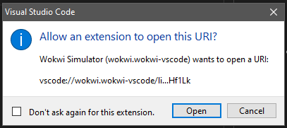
 -->

## Reload Window

Bruk følgende kommando til å starte vscode på nytt for å sikre at alt er i orden

Åpne command palette


Kjør kommandoen

```
Developer: Reload Window
```
