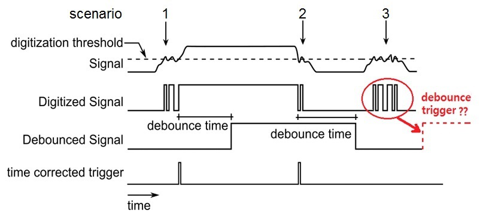

[<- Tilbake](../Exercises/README.md)

# Hackathon 1 Løsningsforslag

## Oppgave 1

- [Kode](1a/1a.ino)
- [Simulering](https://wokwi.com/projects/368627853480448001)

Oppgaven løses ved å lage en debounce krets.


## Oppgave 2

- [Kode](1a/1a.ino)
- [Simulering](https://wokwi.com/projects/368627853480448001)

Oppgaven løses ved å lage en debounce krets.

```cpp
void loop() {
  bool buttonState = digitalRead(BUTTON_PIN);

  if (buttonState != previousButtonState)
  {
    counter += 1;
    Serial.print("Number of button presses and releases detected: ");
    Serial.println(counter);
  }

  previousButtonState = buttonState;
}
```
