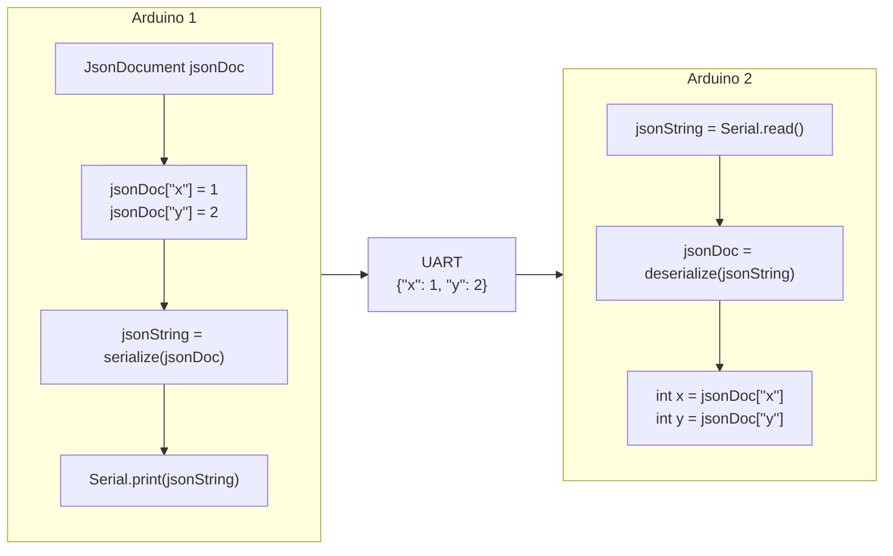

[<- Tilbake](/README.md)

# JSON

## Generelt om formatet

JSON, eller JavaScript Object Notation er ett lettvektig format som blir brukt til å lagre og transportere data. En fordel med formatet er at det er skapt for å være lettleselig og tolkelig, samtidig som at det tilbyr en fleksibel måte å sende forskjellige typer strukturert data mellom programmer og datamaskiner gjennom et universelt maskinleselig format. Data blir lagret slik at hver verdi har ett assosiert navn (som en variabel). Det er et mål at hver pakke skal være selvforklarende og lett å forstå. Det er derfor viktig å bruke passende navn for de ulike verdiene. Formatet ble først utviklet i sammenheng med JavaScript, derav navnet JavaScript Object Notation. Siden JavaScript har vert det eneste utbredte programmeringsspråket som kjører direkte i nettlesere, har JSON blitt den universelle standarden for å sende informasjon mellom tjenere og nettlesere. JSON har i senere tid vist seg å være pålitelig nok til at det bruker nesten over alt i programmeringsverdenen hvor det er behov for å lagre eller utveksle informasjon utenfor et enkelt program. I hovedsak blir JSON formatet brukt når man transporterer data fra en server til en nettside.



Siden strukturen til JSON skal kunne håndtere mange forskjellige typer informasjon, har det behov for en mer kompleks syntax enn for eksempel csv. Derfor skal man som regel aldri tolke JSON formatert tekst med egen kode. Til dette formål brukes en “parser” som leser teksten og spytter ut en datastruktur, som stort sett tar samme form som en python dictionary. For å konvertere denne datastrukturen tilbake til tekst som kan sendes eller lagres brukes en “serializer”. Dette kan høres komplisert ut men “parsing” og “serialization” av JSON kommer alltid i form av to funksjoner som tar imot en dictionary-lignende datastruktur og returnerer tekst eller motsatt. ArduinoJson er et bibliotek som gir oss disse funksjonene, samtidig som at det inkluderer noen praktiske verktøy som løser mange av de mer kompliserte problemstillingene som oppstår når man skal kommunisere mellom enheter. Disse inkluderer blant annet at deserialize() funksjonen kan ta serieporten som argument, og automatisk bestemme hva som er starten og slutten på en melding. En annen oppgave deserialize() gjør for oss er å gi en feilmelding hvis den JSON formaterte teksten i meldingen ikke er gyldig JSON. Det betyr at ved transmisjonsfeil som elektronisk støy, dårlig tilkobling og strømbrudd vil ArduinoJson automatisk si ifra slik at vi automatisk kan ignorere feil formaterte meldinger.

## Eksempel på JSON fil:

```json
{
  "name": "John Wick",
  "age": 42,
  "dog": null,
  "armed": true,
  "status": "Unknown",
  "assosiates": ["Winston", "Charon", "Sofia"],
  "assosiateIntel": {
    "Winston": "Hotel Manager",
    "Charon": "Concierge",
    "Sofia": "Director"
  }
}
```

## Eksempel på lesing av JSON fil med Python:

```python
import json

with open("john_wick.json", "r") as file:
    data = json.load(file)

print("Name:", data["name"])
print("Age:", data["age"])

if data["dog"] is None:
    print("No longer has a dog")
else:
    print("Dog's name is:", data["dog"])

if data["armed"] == True:
    print("Armed")
else:
    print("Unarmed")

print("Status:", data["status"])

print("Assosiates:")
for assosiate in data["assosiates"]:
    intel = data["assosiateIntel"][assosiate]
    print(assosiate + ":", intel)
```

### Resultat:

```
John Wick
42
No longer has a dog
Armed
Status: Unknown
Assosiates:
Winston: Hotel Manager
Charon: Concierge
Sofia: Director
```

## Eksempel

UART dataoverføring med .json

1. Last ned ArduinoJson biblioteket av Benoit Blanchon
1. Last opp følgende kode på Arduino 1(sender)

   ```cpp
   #include <ArduinoJson.h>

   void setup()
   {
       Serial.begin(115200);
   }

   void loop()
   {
       delay(5000);

       // Create a variable of the data type DynamicJsonDocument that has a
       // capacity of 500 bytes (probably enough for our purposes)
       DynamicJsonDocument jsonDoc(500);

       // Add values to the json variable
       jsonDoc["sender"] = "themometer";
       jsonDoc["receiver"] = "webserver";
       jsonDoc["topic"] = "thermometer-sensor-data";
       jsonDoc["temperature"] = 2;

       // Converts the jsonDoc variable to text and saves
       // it in the jsonText variable
       String jsonText;
       serializeJson(jsonDoc, jsonText);

       // Prints the jsonText variable to the Serial port
       Serial.println(jsonText);

       delay(3000);

       // Alternatively this can be done without the string
       serializeJson(jsonDoc, Serial);
   }
   ```

1. Last opp følgende kode på Arduino 2(mottaker)

   ```cpp
   #include <ArduinoJson.h>

   void setup(){
       Serial.begin(115200);
   }

   void printReceivedJson(DynamicJsonDocument &jsonDoc)
   {
       // Extract variables 1 by 1 from the jsonDocument
       String sender = jsonDoc["sender"].as<String>();
       String receiver = jsonDoc["receiver"].as<String>();
       String topic = jsonDoc["topic"].as<String>();
       int temperature = jsonDoc["temperature"].as<int>();

       // Print the data
       Serial.println("Received data:");
       Serial.println("Receiver: " + sender);
       Serial.println("Mottaker: " + receiver);
       Serial.println("Topic: " + topic);
       Serial.println("Temperatur: " + String(temperature));
   }

   void readSerial()
   {
       // Is there data on the serial port?
       if (Serial.available() > 0)
       {
           // Create a variable of the data type DynamicJsonDocument that has a
           // capacity of 500 bytes (probably enough for our purposes)
           DynamicJsonDocument jsonDoc(500);

           // Read the string coming from the "Serial" port, find the variables
           // and save them in the jsonDoc variable
           DeserializationError error = deserializeJson(jsonDoc, Serial);

           // If there is an error, print it out
           // and return from (stop running) the function
           if (error != DeserializationError::Ok)
           {
               Serial.print(F("deserializeJson() failed with the error message: "));
               Serial.println(error.c_str());
               return;
           }

           printReceivedJson(jsonDoc);
       }
   }

   void loop()
   {
       // Run the function that handles incoming communication
       readSerial();
   }
   ```

1. Koble `TX(1)` på Arduino 1 sammen med `RX(0)` på Arduino 2
1. Åpne seriemonitor for mottaker
1. Sammenlign dette eksempelet med ‘Kommunikasjon med SoftwareSerial’ ser du noen fordeler (eller ulemper) med å bruke .json i dine egne prosjekt?
